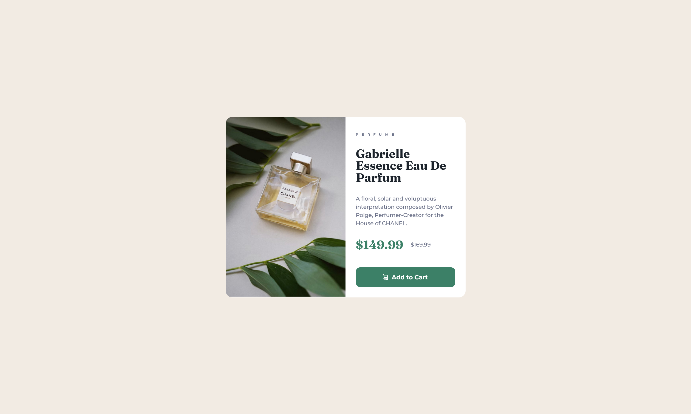

# Frontend Mentor: product-preview-card-component solution

This is a solution to the [product-preview-card-component challenge on Frontend Mentor](https://www.frontendmentor.io/challenges/product-preview-card-component-GO7UmttRfa). Frontend Mentor challenges help you improve your coding skills by building realistic projects. 

## Table of contents

- [Overview](#overview)
  - [The challenge](#the-challenge)
  - [Screenshot](#screenshot)
  - [Links](#links)
- [My process](#my-process)
  - [Built with](#built-with)
  - [Useful resources](#useful-resources)
- [Author](#author)

## Overview

### The challenge

Users should be able to:

- View the optimal layout depending on their device's screen size
- See hover and focus states for interactive elements

### Screenshot

### Links

- Solution URL: [github:diremanwolf/preview-product-card-component](https://github.com/diremanwolf/product-preview-card-component)

## My process

### Built with

- Flexbox
- CSS Grid
- Semantic HTML5 markup
- CSS custom properties

## Author

- Github - [@diremanwolf](https://github.com/diremanwolf)
- Frontend Mentor - [@diremanwolf](https://www.frontendmentor.io/profile/diremanwolf)
